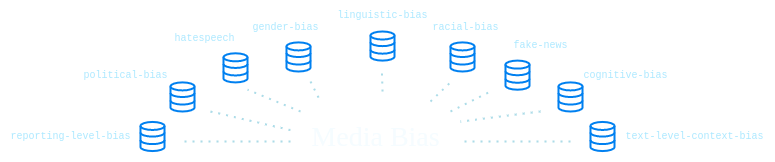

# Introducing MBIB - the first Media Bias Benchmark Task and Dataset Collection


# 1. Introduction
This repository contains all resources from the paper "Introducing MBIB - the first Media Bias Benchmark Task and Dataset Collection"


# 2. Datasets
----
## Get started with MBIB
To facilitate research of media bias we share our MBIB corpus on huggingface, as an easy entrypoint for data scientists of all skill levels. The corpus can be found on https://huggingface.co/datasets/mediabiasgroup/mbib and fetched through few lines of code:
```python 
from datasets import load_dataset

dataset = load_dataset("mediabiasgroup/mbib", "cognitive-bias")
# use any of the following config names as a second argument:
"cognitive-bias", "fake-news", "gender-bias", "hate-speech", 
"linguistic-bias", "political-bias", "racial-bias", "text-level-bias"
```

## Dataset processing
For preprocessing of the datasets, please first install python dependencies:
```
pip install -r datasets/requirements.txt
```
The `/datasets` directory contains directories for all 22 MBIB datasets. Each dataset has it's ID unique within [this list](https://docs.google.com/spreadsheets/d/1BXcDcnBluSzv1bwwAEpRH61ObXd3Mxf66qsOVxilTXM/edit#gid=0).

Each dataset directory is structured as follows:
```
├─ id_name
     |
     ├─── raw
     |    ├─── raw_data
     |    └─── README.md
     |
     ├──── id-name.csv
     ├──── process.py
     └──── README.md
```
Where 
1. `raw` directory contains raw data and `README.md` file with instructions how to obtain the raw data. Few datasets we either cannot distribute or are too large in its raw form, therefore it's on the user to get them according to the instructions.
2. `process.py` is a processing script that generates processed file `id-name.csv` out of raw data.
3. `README.md` contains information about the dataset, citation information and original source.

 
## Create MBIB
In order, to obtain the full MBIB corpus run
```
python process_all_datasets.py
```
which processes all the datasets, if they have their raw data available and subsequently merges the datasets into 8 Tasks. For more information about the Tasks please see our paper.
The output of the script can be found in `/datasets/mbib-full`

The example instances of each MBIB task can be found in the following:

| Task | Example from the MBIB datasets |
| -|----|
| Linguistic bias | “A Trump-loving white security guard with a racist past shot and killed an unarmed Black man during an unprovoked hotel parking lot attack"|
| Text-level Context Bias |  “The governor [...] observed an influx of Ukrainian citizens who want to stay in Russia until the situation normalises in their country” | 
| Reporting-Level Context Bias | In a presidential campaign, one candidate receives a disproportionate amount of news coverage. | 
| Cognitive Bias | “Republicans are certain that the more people learn the less they’ll like about the Democrats approach” |
| Hate Speech | “I will call my friends and we go [...] up that [...]” |
| Racial bias| “black people have a high crime rate therefore black people are criminals”| 
| Fake news | “Phoenix Arizona is the No 2 kidnapping capital of the world” |
| Gender Bias | “For a woman that is good.” |
| Political bias | “Generally happy with her fiscally prudent, dont-buy-what-you-cant-afford approach [...]” (classified right) vs “[...] some German voters have also begun to question austerity.” (classified left) 

# 4. Baseline
In order to reproduce the baseline results from our paper, 
please install the python requirements:
```
pip -r install baseline/requirements.txt
```
and run the training script:
```
python baseline/run_baseline.py
```
For more information about the methods and training procedure please see [README in baseline directory](./baseline/README.md).

# 5. Citation
Please cite us as:
```
@InProceedings{Spinde2021f,
    title = "Neural Media Bias Detection Using Distant Supervision With {BABE} - Bias Annotations By Experts",
    author = "Spinde, Timo  and
      Plank, Manuel  and
      Krieger, Jan-David  and
      Ruas, Terry  and
      Gipp, Bela  and
      Aizawa, Akiko",
    booktitle = "Findings of the Association for Computational Linguistics: EMNLP 2021",
    month = nov,
    year = "2021",
    address = "Punta Cana, Dominican Republic",
    publisher = "Association for Computational Linguistics",
    url = "https://aclanthology.org/2021.findings-emnlp.101",
    doi = "10.18653/v1/2021.findings-emnlp.101",
    pages = "1166--1177",
}
```