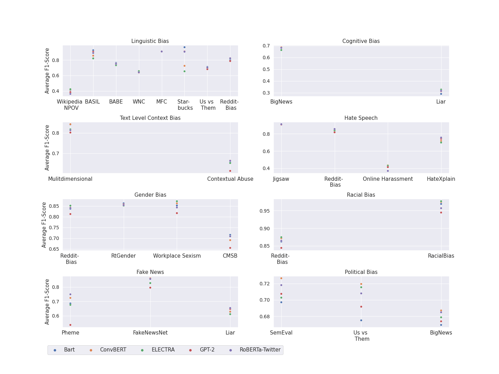

# Baseline training & evaluation
Implementation of the experiments performed in the paper. See baseline performance on various tested models below.
Baseline performances are the best results of the five transfomer models tested:


| Task | Model | Micro F1 | Macro F1 |
| --- | --- | --- | --- |
| cognitive-bias | ConvBERT/ConvBERT | 0.7126 | 0.7664 |
| fake-news | Bart/RoBERTa-T | 	0.6811 | 0.7533 |
| gender-bias | RoBERTa-T/ELECTRA | 0.8334 | 0.8211 |
| hate-speech | RoBERTA-T/Bart | 0.8897 | 0.7310 |
| linguistic-bias | ConvBERT/Bart | 0.7044 | 0.4995 |
| political-bias | ConvBERT/ConvBERT | 0.7041 | 0.7110 |
| racial-bias | ConvBERT/ELECTRA | 0.8772 | 	0.6170 |
| text-level-bias | ConvBERT/ConvBERT | 0.7697 | 	0.7532 |

## Reproduce results
In order to reproduce the baseline results 
please install the python requirements:
```
pip -r install baseline/requirements.txt
```
and run the training script:
```
python baseline/run_baseline.py
```

## Files descriptions
* `run_baseline.py`
  * script where specifics of the training are defined, see example below
   ```python
    wrapper = TrainerWrapper(5, 'cognitive-bias', "bart", gpu=0,batch_size=64, model_length=78)
    result = wrapper.run()
   ```
* `trainer/model_specifications.py`
    - This file is used by `TrainerWrapper.py` for specification of the model, which is accessed through huggingface.
    - the following models were evaluated, models were chosen because they showed best performances on the BABE dataset:
      * [ConvBert](https://huggingface.co/YituTech/conv-bert-base)
      * [Bart](https://huggingface.co/facebook/bart-base)
      * [TwitterRoBERTa](https://huggingface.co/cardiffnlp/twitter-roberta-base)
      * [GPT2](https://huggingface.co/gpt2)
      * [Electra](https://huggingface.co/google/electra-base-discriminator)
* `trainer/TrainerWrapper.py`
  * This is a wrapper class that wraps tokenization, configuration and training of the model into k-fold cross-validation.
* `trainer/ModelTrainer.py`
  * Main training class using accelerator for improved training and [Weights & Biases](https://wandb.ai/home) for logging. If you want to use the weights & biases, put your wandb API key to the `config.py`
  
## Result analysis
All baseline evaluation results: 
|	Bias Type	|	Rank	|	Model	|	Macro-Score	|	Rank	|	Model	|	Micro-Score	|
|	---	|	---	|	---	|	---	|	---	|	---	|	---	|
|	Linguistic Bias	|	1	|	Bart	|	0.7664	|	1	|	ConvBert	|	0.7126	|
|		|	2	|	RoBERTa-Twitter	|	0.7479	|	2	|	ELECTRA	|	0.7122	|
|		|	3	|	GPT-2	|	0.7459	|	3	|	Bart	|	0.7106	|
|		|	4	|	ConvBERT &	|	0.7283	|	4	|	Roberta-Twitter	|	0.7102	|
|		|	5	|	ELECTRA	|	0.7136	|	5	|	GPT2	|	0.7011	|
|		|		|		|		|		|		|		|
|	Cognitive Bias	|	1	|	ConvBERT	|	0.4995	|	1	|	ConvBert	|	0.7044	|
|		|	2	|	RoBERTa-Twitter	|	0.4986	|	2	|	Bart	|	0.7042	|
|		|	3	|	GPT-2	|	0.4968	|	3	|	Roberta-Twitter	|	0.7006	|
|		|	4	|	ELECTRA	|	0.4949	|	4	|	GPT2	|	0.6976	|
|		|	5	|	Bart	|	0.4881	|	5	|	ELECTRA	|	0.6777	|
|		|		|		|		|		|		|		|
|	Text-Level Context Bias	|	1	|	ConvBERT	|	0.7532	|	1	|	ConvBert	|	0.7697	|
|		|	2	|	Bart	|	0.7477	|	2	|	Roberta-Twitter	|	0.7689	|
|		|	3	|	RoBERTa-Twitter	|	0.7382	|	3	|	Bart	|	0.7622	|
|		|	4	|	ELECTRA	|	0.7347	|	4	|	ELECTRA	|	0.7532	|
|		|	5	|	GPT-2	|	0.7075	|	5	|	GPT2	|	0.7447	|
|		|		|		|		|		|		|		|
|	Hate Speech	|	1	|	Bart	|	0.731	|	1	|	Roberta-Twitter	|	0.8897	|
|		|	2	|	ConvBERT	|	0.7248	|	2	|	GPT2	|	0.8824	|
|		|	3	|	RoBERTa-Twitter	|	0.7229	|	3	|	ELECTRA	|	0.8821	|
|		|	4	|	GPT-2	|	0.7198	|	4	|	ConvBert	|	0.8805	|
|		|	5	|	ELECTRA	|	0.7184	|	5	|	Bart	|	0.8797	|
|		|		|		|		|		|		|		|
|	Gender Bias	|	1	|	ELECTRA	|	0.8211	|	1	|	Roberta-Twitter	|	0.8334	|
|		|	2	|	Bart	|	0.8168	|	2	|	Bart	|	0.8333	|
|		|	3	|	ConvBERT	|	0.8119	|	3	|	ELECTRA	|	0.8305	|
|		|	4	|	RoBERTa-Twitter	|	0.8116	|	4	|	ConvBert	|	0.8257	|
|		|	5	|	GPT-2	|	0.7852	|	5	|	GPT2	|	0.8134	|
|		|		|		|		|		|		|		|
|	Racial Bias	|	1	|	ELECTRA	|	0.617	|	1	|	ConvBert	|	0.8772	|
|		|	2	|	ConvBERT	|	0.6153	|	2	|	ELECTRA	|	0.8768	|
|		|	3	|	Bart	|	0.6103	|	3	|	Roberta-Twitter	|	0.8728	|
|		|	4	|	RoBERTa-Twitter	|	0.607	|	4	|	Bart	|	0.8693	|
|		|	5	|	GPT-2	|	0.5961	|	5	|	GPT2	|	0.8508	|
|		|		|		|		|		|		|		|
|	Fake News	|	1	|	RoBERTa-Twitter	|	0.7533	|	1	|	Bart	|	0.6811	|
|		|	2	|	ConvBERT	|	0.7382	|	2	|	ConvBert	|	0.6787	|
|		|	3	|	Bart	|	0.7236	|	3	|	Roberta-Twitter	|	0.6721	|
|		|	4	|	ELECTRA	|	0.7049	|	4	|	ELECTRA	|	0.6574	|
|		|	5	|	GPT-2	|	0.6596	|	5	|	GPT2	|	0.6094	|
|		|		|		|		|		|		|		|
|	Political Bias	|	1	|	ConvBERT	|	0.711	|	1	|	ConvBert	|	0.7041	|
|		|	2	|	RoBERTa-Twitter	|	0.7036	|	2	|	Roberta-Twitter	|	0.7021	|
|		|	3	|	ELECTRA	|	0.6989	|	3	|	Bart	|	0.6997	|
|		|	4	|	GPT-2	|	0.6909	|	4	|	GPT2	|	0.696	|
|		|	5	|	Bart	|	0.6804	|	5	|	ELECTRA	|	0.6255	|


The figure below depicts the performance of all models per dataset:

