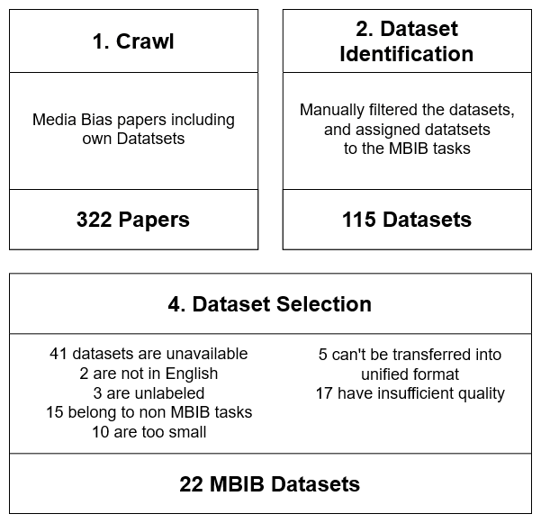

# Dataset collection
The 22 tasks in this repository were carefully selected out of bigger, more extenstive collection under several criteria.

Below, you can see the process diagram of creating of the MBIB.
For more details about the selection process, please see our paper.

-----------
Each Task is represented by a set of bias-related datasets. The distribution and sizing can be seen in the following table. 

| Bias Type |Dataset| Data Points|
|------|-----------|----------|
| Linguistic Bias                                 | Wikipedia NPOV| 11,945               |
|                                                 | BABE                           | 3,673                |
|                                                 | Wiki Neutrality Corpus| 362,991              |
|                                                 | UsVsThem                                | 6,863                |
|                                                 | RedditBias                | 10,583               |
|                                                 | Media Frames Corpus                 | 37,622               |
|                                                 | BASIL                      | 1,726                |
|                                                 | Biased Sentences                                        | 842                  |
|                                                 |                                                                              | Σ 433,677 |
||
| Cognitive Bias                                  | BIGNEWS   | 2,331,552            |
|                                                 | Liar Dataset   | 12,835               |
|                                                 |                                                                              | Σ 2,344,387 |
||
| Text-Level Context | Contextual Abuse Dataset | 26,235|
|                                                 | Multidimensional Dataset     | 2,094                |
|                                                 |                                                                              |Σ 28,329|
||
| Hate Speech                                     | Kaggle Jigsaw         | 1,999,516            |
|                                                 | HateXplain                     | 20,148               |
|                                                 | RedditBias        | 10,583               |
|                                                 | Online Harassment Corpus             | 20,427               |
|                                                 |                                                                              |Σ 2,050,674|
||
| Gender Bias                                     | RedditBias               | 3,000                |
|                                                 | RtGender                         | 15,351               |
|                                                 | WorkPlace sexism                 | 1,136                |
|                                                 | CMSB                   | 13,634               |
|                                                 |                                                                              |Σ 33,121 |
||
| Racial Bias                                     | RedditBias                 | 2,620                |
|                                                 | RacialBias                             | 751                  |
|                                                 |                                                                              |Σ 2,371|
||
| Fake News                                       | Liar Dataset                              | 12,835               |
|                                                 | PHEME                           | 5,222                |
|                                                 | FakeNewsNet                     | 6,337                |
|                                                 |                                                                              |Σ 24,394|
||
| Political Bias                                  | UsVsThem                                  | 6,863                |
|                                                 | BIGNEWS                  | 2,331,552            |
|                                                 | SemEval                             | 9,783                |
|                                                 |                                                                              |Σ 2,348,198|

------
## Files description
* `data_utils.py`
  * Contains `TweetLoader` class that fetches batches or single tweets from TwitterAPI.
  * Contains `MBIBDataLoader` class, that aggregates processed datasets into 8 Tasks.   This class is used by `create_corpus.py` script to create final corpus.
  
